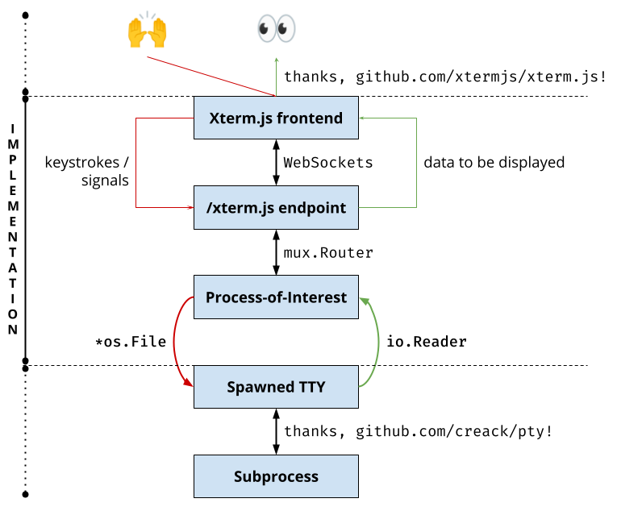

# web-terminal
build Go backend for Xterm.js to get a shell over the browser

### Target
- 1. Get a stand-alone terminal displayed in the browser using _Xterm.js_

- 2. Get the stand-alone terminal to _connect_ with a Go backend service
  - The attach addon provides methods for attaching a terminal to a WebSocket stream, such as Docker's WebSocket attach endpoint.
  - This means that the front-end terminal will render the stdout and stderr logs of the back-end process and will send to it all keyboard and mouse events captured.

- 3. Write the middleware logic to reflect host machine's shell in the browser

- 4. Add _configuration_ to run an arbitrary application instead of host shell.

- 5. Create a _Docker image_ that would allow deployment using a container, and also to enable extension via a child Dockerfile that can inject its own arbitrary binaries.

- 6. Create a Helm chart that would allow this to be deployed into a K8s cluster with the correct RBAC permissions tied to the workload's associated ServiceAccount resource.

### Extended Information
[xtermjs.org](https://xtermjs.org/docs/)

[xtermjs Addons/attach](https://xtermjs.org/docs/api/addons/attach/)

[creack/pty](https://github.com/creack/pty)
